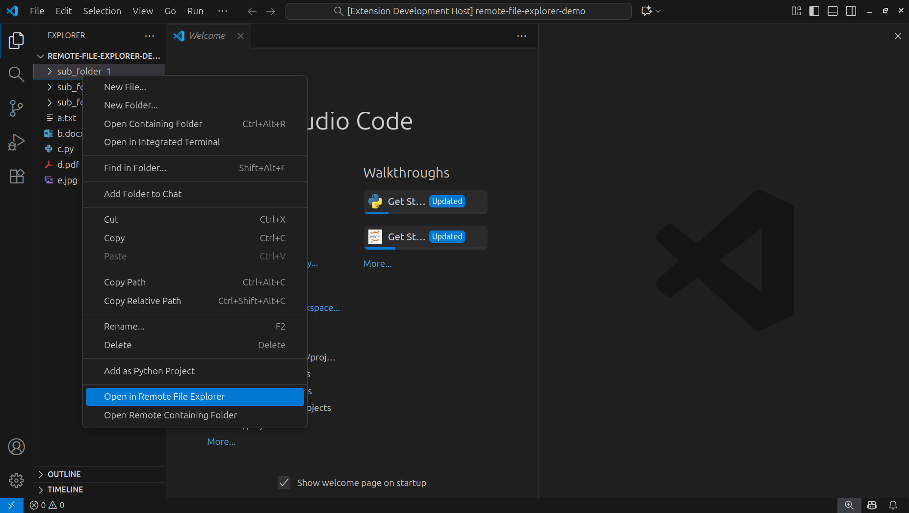

# Remote File Explorer — VS Code Extension

Remote File Explorer is a lightweight VS Code extension that opens a browsable file explorer in a Webview panel. It provides a compact visual file browser with grid/list views, zoom controls, context menu actions, and navigation (back/forward/up) similar to a desktop file manager.

## Key features

- Grid and list views for browsing files and folders
- Zoom controls (increase/decrease thumbnail size)
- Context menu (Open file / Open folder)
- Double-click behavior:
	- Double-click a folder: opens in the same webview panel
	- Shift + double-click a folder: opens in a new panel/tab
- Back / Forward / Up navigation with history tracking
- Open files in the main editor from the webview

## Commands

The primary (and most convenient) way to open the Remote File Explorer is via the Explorer context menu — right-click any file or folder in the VS Code Explorer and choose "Open in Remote File Explorer" (this runs the `remoteFileExplorer.openInremoteFileExplorer` command for the selected resource).

The extension exposes these commands (use the Command Palette or bind keys):

- `remoteFileExplorer.openInremoteFileExplorer` — Open a specific folder in the Remote File Explorer (prompts for a path if none provided)
- `remoteFileExplorer.openInRemoteContainingFolder` — Open the containing folder of the currently active file

## Usage

1. Open the Command Palette (Ctrl+Shift+P) and run `Remote File Explorer: Open in remoteFileExplorer` (or use the `remoteFileExplorer.openInremoteFileExplorer` command).
2. Enter a folder path or pass a folder URI when invoking the command.
3. Use the toolbar at the top of the webview to switch between list/grid, zoom, or navigate:
	 - ← Back: go to previous folder in history
	 - → Forward: go to next folder in history (if any)
	 - ↑ Up: go to the parent folder
4. Double-click a folder to open it in the same panel. Hold Shift while double-clicking to open the folder in a new panel/tab.
5. Double-click a file or choose Open from the context menu to open it in the editor.

## Developer notes

- Project structure (relevant files):
	- `src/extension.ts` — activation and command registration
	- `src/fileExplorerPanel.ts` — creates the webview panel and manages navigation/history
	- `src/webviewContent.ts` — builds the webview HTML
	- `media/webview.js` — client-side webview JS (UI interactions)
	- `media/styles.css` — webview styling

- If you modify the webview assets, remember to use `webview.asWebviewUri` in `webviewContent.ts` so VS Code serves them correctly.

## Developing & testing

1. Install dependencies and open this folder in VS Code.
2. Run the extension in the Extension Development Host (F5 in VS Code).
3. Use the Command Palette in the host window to invoke the commands above.

Quick checks:

- Ensure `tsconfig.json` and `package.json` are configured correctly for the extension host.
- When editing TypeScript sources, build/typecheck to catch issues early.

## Troubleshooting

- If the webview shows blank content after changes, ensure the webview script/style URIs are generated with `webview.asWebviewUri(...)` and that `localResourceRoots` includes the `media` folder.
- If navigation buttons don't update, check the messages sent from the extension to the webview (`postMessage`) and that the webview listens for `updateNavigation` messages.
- For file access errors, ensure the provided path exists and the extension has permission to read it.

## Contributing

Contributions are welcome. Open issues or PRs for bugs and feature requests. Keep changes focused and include tests where relevant.

## License

This project is licensed under the MIT License — see the `LICENSE` file at the project root for the full text.

---

If you'd like, I can also add a short 'Try it' example to the README that includes sample commands and screenshots (if you provide images).
